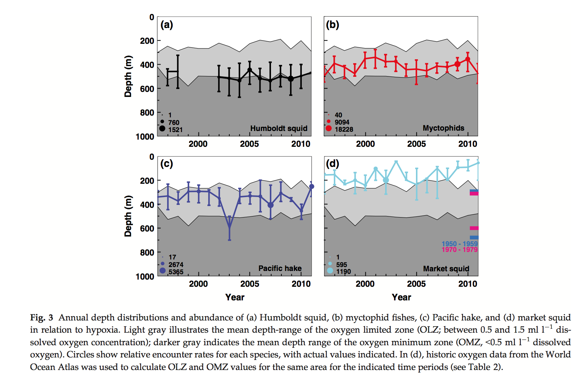
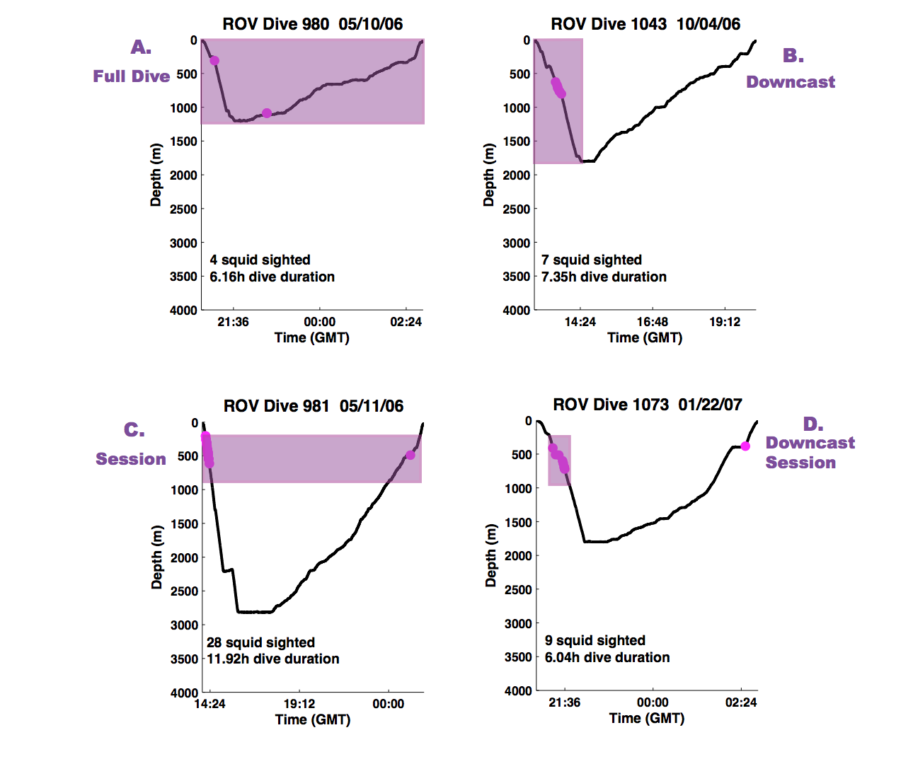

```{r setup, include=FALSE}
knitr::opts_chunk$set(echo = TRUE)
```

Here we'll try to recreate figures from [Stewart et al. 2014](http://onlinelibrary.wiley.com/doi/10.1111/gcb.12502/abstract): "Combined climate- and prey-mediated range expansion of Humboldt squid (Dosidicus gigas), a large marine predator in the California Current System."

## Figure 3 from Stewart et al 2014:

Starting with Figure 3:


Where are the files that created this? Looking through my computer (notes below) led me to `gamTrix_Squid_2013_01_07.txt`. We'll explore it.

## Metadata 

Data are processed from [MBARI (Monterey Bay Aquarium Research Institute)](https://www.mbari.org), from a combination of databases. Visual observations at depth are from the [VARS database](https://www.mbari.org/products/research-software/video-annotation-and-reference-system-vars/), and oceanographic data (e.g. temperature, dissolved oxygen at depth) are from the internal MBARI CTD database. 

**DiveNumber**: MBARI dive number assigned to each ROV dive, with decimals indicating vessel  
**Depth**: Depth in meters   
**Oxygen**: Dissolved oxygen in mL/L  
**Temperature**: Degrees in Celcius  
**VarsCount**: Squid count  
**DiveDateVSqYr**: "Squid Year" when ROV dive occurred ("squid years" go from March (03) - February (14))  
**DiveDateVSqMonth** "Squid Month" when ROV dive occurred ("squid months" go from March (03) - February   (14))


## Recreate fig 3a squid depths

Let's have a look at `gamTrix_Squid_2013_01_07.txt`, in R.

```{r setup analyses, warning=FALSE, message=FALSE}
## setup
library(tidyverse) # install.packages('tidyverse')
library(skimr) # install.packages('skimr')

## read in data
sqdata_raw <- read_table2("data/gamTrix_Squid_2013_01_07.txt")

## quick summaries
#skimr::skim(sqdata_raw)
```

### Wrangle and plot. 

<!---
According to `sem_figsFinal.m`, errorbars were calculated by: 
`errorbar(semTrixSqYrUni, Lo_median_q_nY(:,1), abs(Lo_median_q_nY(:,2)-Lo_median_q_nY(:,1)), abs(Lo_median_q_nY(:,3)-Lo_median_q_nY(:,1)), 'c', 'linewidth', 2)`
--->

```{r, warning=FALSE}
## wrangle; summarize by median as in original
sqdata <- sqdata_raw %>%
  select(-X8) %>%
  group_by(SqYear) %>%  # include SqMonth to summarize by SqMonth too
  summarise(CountGrouped = sum(Count),
            DepthGrouped = median(Depth, na.rm=TRUE),
            OxyGrouped   = median(Oxy, na.rm=TRUE),
            TempGrouped  = median(Temp, na.rm=TRUE))

## just to check
# skimr::skim(sqdata)

## plot squid by depth
ggplot(data = sqdata, aes(x = SqYear, y = DepthGrouped)) +
  scale_y_reverse(lim=c(1000, 0)) +
  geom_point(aes(size = CountGrouped))
```

It looks pretty similar. However, Fig. 3 has no squid plotted in 1999, 2000, 2001, and also the highest count in this plot (2226) is higher than in Fig. 3 (1521). I suspect these data that we have plotted here were not filtered by the same depth range than was ultimately done for Fig. 3. I think this is the full dive (i.e. A in the figure below) and Fig. 3 used just the downcast session (i.e. D in the figure below). This figure is from my PhD dissertation: [Stewart 2012, Stanford University](https://purl.stanford.edu/pb685tk3754).




## Motivation and background


Searching through my files, both navigating and using Mac's search feature:

`sem_figsFinal.m` is what created the figures for the paper, saving it as. `DepthO2_Subplot.pdf` (filepath: /Users/julialowndes/Dropbox/Thesis/Dg_Abundance/MBARI_Dg/sem_figsFinal.m).

However, the figures for the paper were created as part of the analysis workflow, meaning that I didn't save the figure-input data as a separate .csv file when I created the figure. So walking back through different scripts and trying to find somewhere data are available is tricky.

`semTrixSqYMTot` is the matrix that creates the Humboldt subplot, searching earlier in this file for that says "% Sq and Prey month-year ones were made in sem_prey: semTrixSqYMTot, semTrixMyYMTot etc".

In `sem_prey.m`, a search for `semTrixSqYMTot` exactly finds nothing. But it looks like `gamTrix_Squid_2013_02_22.txt` was saved. Look for it in Mac search: it's an empty file, just headers. But `gamTrix_Squid_2013_01_07.txt` shows up, probably closest thing to what we want. This script was to see if it is. 

(First some more sleuthing: Looking through `sem_figsFinal.m` more, it seems like the matrix `semTrix` is where it all begins. Searching the Mac for this returns a lot, including `sem_manage.m`. Could follow on this trail more


[PhD dissertation](https://purl.stanford.edu/pb685tk3754) 2012.